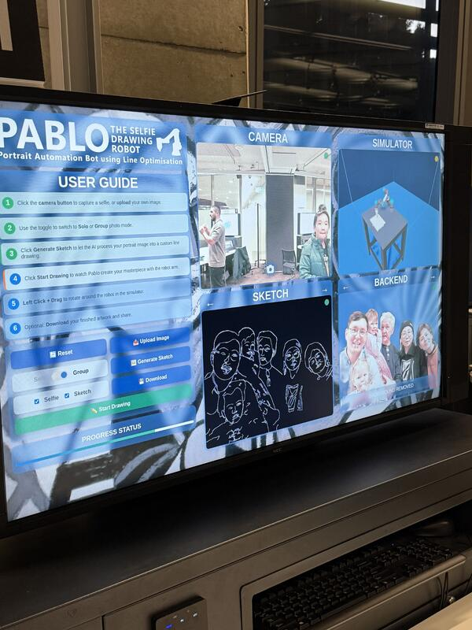
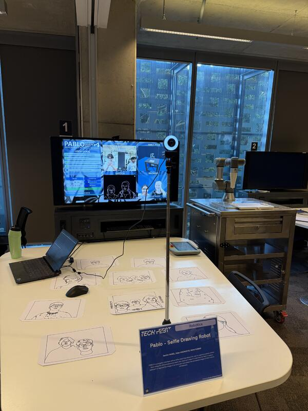

# P.A.B.L.O - LAB 4 Robotics Studio 2 Project
 
Our project allows the user to take a selfie using the GUI and watch as our robot arm traces the outline of their face on card with a marker.

 
## How it works
- The User takes a selfie using the main computer's webcam which is them processed using our computer vision algorithm to generate an outline of the user's face with enough details to capture their likeness
- This sketch image is then converted into a series of points and coordinates using path planning and optimisation algorithms, to maximise the image fidelity whilst drawing the image in the shortest time possible. This is then handed out in packets of   data to be recieved by the UR3e robot
- The UR3e which has a marker attached to it then reads these points and scales them appropriately to the canvas in it's space, and proceeds to draw it out.
  
## Demo
 

 
## Gallery
 
| | |
|---|---|
|  |  |
 
